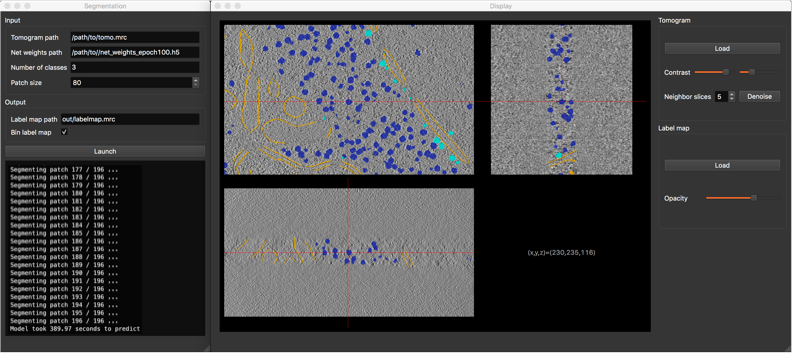

# Deep Finder
This is purely implementation for analysis ! Credit for the code to the respective owners!

The code in this repository is described in [this pre-print](https://www.biorxiv.org/content/10.1101/2020.04.15.042747v1). This paper has been submitted to Nature Methods and has now been [published](https://doi.org/10.1038/s41592-021-01275-4).

 
 
__To reviewers__: you can follow our [tutorial](https://deepfinder.readthedocs.io/en/latest/tutorial.html) to reproduce segmentations from our paper.
or Follow more detailed version explained in the below [section](##refrence)

  

__Disclaimer:__ DeepFinder is still in its early stages, any feedback is welcome for enhancing the user experience.

  

__News__: (29/01/20) A first version of the GUI is now available in folder pyqt/. [More information...](###Using the GUI)

  

__News__: (01/06/22) A first version of the [Napari](https://napari.org) GUI (Napari plugin) is available here: https://github.com/deep-finder/napari-deepfinder.

  

## Contents

- [System_Requirements](##System_Requirements)

- [Installation_Guide](##Installation_Guide)

- [Instructions_for_use](##Instructions_for_use)

- [Documentation](https://deepfinder.readthedocs.io/en/latest/)

- [Google group](https://groups.google.com/g/deepfinder)

  

## System_Requirements

__PythonVersion__:__Deep Finder__ has been implemented using __Python 3__ (_Python >= 3.8 is required_) and is based on the __Keras__ package. It has been tested on Linux and should also work on Mac OSX as well as Windows.

  

__CUDA__: The algorithm needs an __Nvidia GPU__ and __CUDA__ to run at reasonable speed (in particular for training). The present code has been tested on Tesla K80 and M40 GPUs. For running on other GPUs, some parameter values (e.g. patch and batch sizes) may need to be changed to adapt to available memory.


  

```diff

- If above conditions are not met, we cannot guarantee the functionality of our code at this time.
```
__Git LFS__: As .mrc file are very large in size so git Large file system is used in this repo to maintain it. Install it using the instruction on their [site](##https://git-lfs.github.com).

For Ubuntu System :
```
$ sudo apt-get install git-lfs
```


### Package dependencies

Deep Finder depends on following packages. The package versions for which our software has been tested are displayed in brackets:
These package version are made to compatible with python==3.8.13 version 

```

tensorflow==2.6.0

Keras==2.6.0

h5py==3.1.0

lxml==4.8.0

mrcfile==1.1.2

scikit-learn==1.0.2

scikit-image==0.19.2

matplotlib==3.5.2

PyQt5==5.15.6

pyqtgraph==0.10.0

openpyxl==3.0.3

scipy==1.5.4

numpy

pycm
```

  
  

## Installation_Guide

Before installation, you need a python environment on your machine( So that custom python and module version doesnt interfere with global versions) . If this is not the case, we advise installing [Anaconda](https://docs.anaconda.com/anaconda/install/linux/).

!make the environment with python>=3.8 version


 

### Legacy installation method
Git clone the repository 
```
$ git clone https://github.com/horizenight/DeepFinderModified.git
```

You need to download the present repository. Next, open a terminal, place yourself in your deep-finder folder and run:

```

cd /path/to/deep-finder/

pip install -r requirements.txt

```

Also, in order for Keras to work with your Nvidia GPU, you need to install CUDA. For more details about installing Keras and CUDA, please see [Keras installation instructions](https://keras.io/#installation).

  

Once these steps have been achieved, the user should be able to run Deep Finder.

As the recent changes to path were made , it is better to runscript in this stucture 
```
python -m deepfinder.folder_name.script_name
```

  

## Instructions_for_use

### Using the scripts

Instructions for using Deep Finder are contained in folder examples/. The scripts contain comments on how the toolbox should be used. To run a script, first place yourself in its folder. For example, to run the target generation script:

```

python -m deepfinder.examples.training.step1_generate_target
```

### Using the GUI

#### NEW GUI!

You can use a new GUI that has been developed for deepfinder as a [Napari](https://napari.org) plugin, you can find more information on https://github.com/deep-finder/napari-deepfinder.

  

#### New method (when downloaded and installed directly via pip)

6 different commands (GUIs) are available by directly typing the command in the python environment (`display`, `annotate`, `generate_target`, `train`, `segment`, `cluster`)

In your environment, write the following command for example to run the target generation GUI:

```generate_target```

  

#### Legacy method

The GUI (Graphical User Interface) is launchable from folder bin/, and should be more intuitive for those who are not used to work with script. Currently, 6 GUIs are available (tomogram display, tomogram annotation, target generation, training, segmentation, clustering) and allow the same functionalities as the scripts in example/. To run a GUI, first open a terminal. For example, to run the target generation GUI:

```
cd path/to/deepfinder
python -m deepfinder.bin.generate_target
```

  



  
  

__Notes:__

- working examples are contained in examples/analyze/, where Deep Finder processes the test tomogram from the [SHREC'19 challenge](http://www2.projects.science.uu.nl/shrec/cryo-et/2019/).

- The script in examples/training/ will fail because the training data is not included in this Gitlab.

- The evaluation script (examples/analyze/step3_launch_evaluation.py) is the one used in SHREC'19, which needs additional packages (pathlib and pycm, can be installed with pip). The performance of Deep Finder has been evaluated by an independent group, and the result of this evaluation has been published in Gubins & al., "SHREC'19 track: Classification in cryo-electron tomograms".